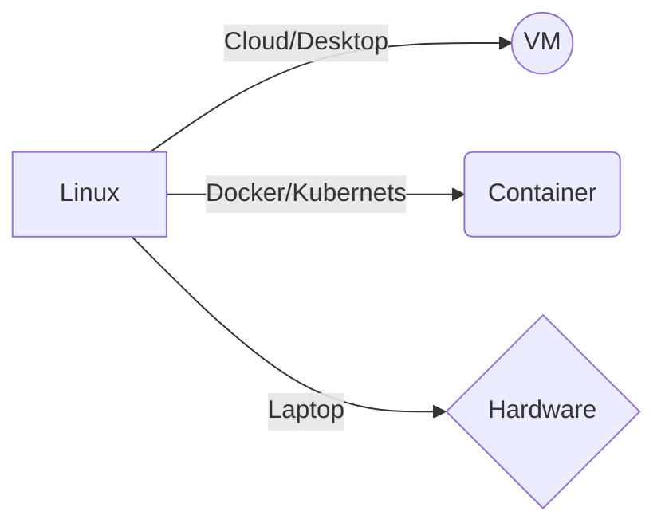

# linux_bash_data

## VM

Se pueden utilizar programas como [Parallels](https://www.parallels.com/mx/pd/general/?gclid=Cj0KCQjw_7KXBhCoARIsAPdPTfjUC4p6a_qPQ72dvOrr_f14ls4zR-ecWaQdTdTyCkokc9W3IiXQJ8gaAsODEALw_wcB), para elegir sistemas operativos y trabajr en ellos mediante la nube. 

Otra opción para trabajar bash en la nube son los servicios de [Amazon](https://signin.aws.amazon.com/signin?redirect_uri=https%3A%2F%2Fconsole.aws.amazon.com%2Fconsole%2Fhome%3FhashArgs%3D%2523%26isauthcode%3Dtrue%26nc2%3Dh_ct%26src%3Dheader-signin%26state%3DhashArgsFromTB_us-west-1_3e1f6a32a4275b6f&client_id=arn%3Aaws%3Asignin%3A%3A%3Aconsole%2Fcanvas&forceMobileApp=0&code_challenge=Z5G7MeEi2yoHGpSMItI7feahOjznNCoHnC0fUuN7ZZk&code_challenge_method=SHA-256), a partir de aquí podemos crear entornos con distintos sistemas operativos. 

## Docker

Al tener docker podemos tener acceso a distitos entornos contenidos de distintos sistemas operativos, y acceder a Kubernets.

> Kubernetes es un sistema de código libre para la automatización del despliegue, ajuste de escala y manejo de aplicaciones en contenedores que fue originalmente diseñado por Google y donado a la Cloud Native Computing Foundation. Soporta diferentes entornos para la ejecución de contenedores, incluido Docker.
