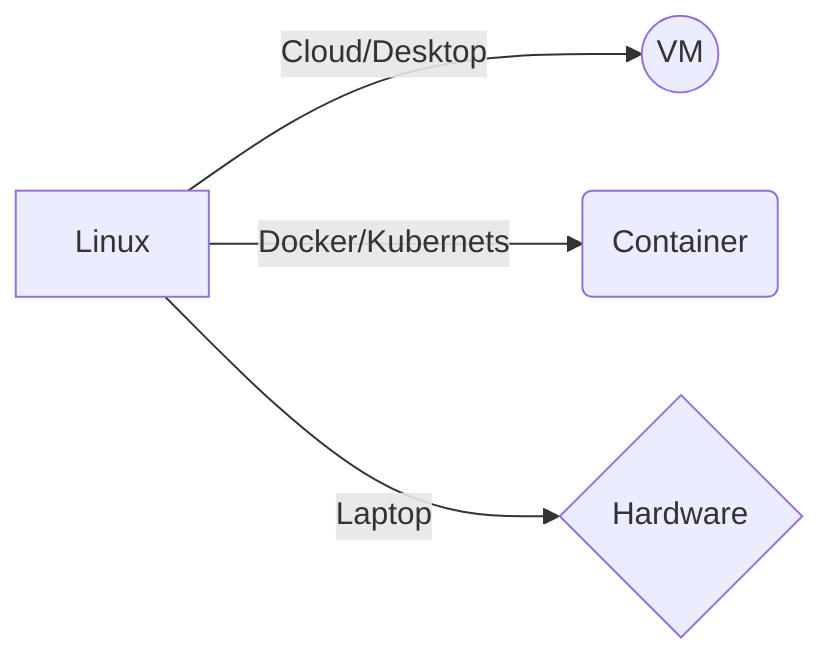
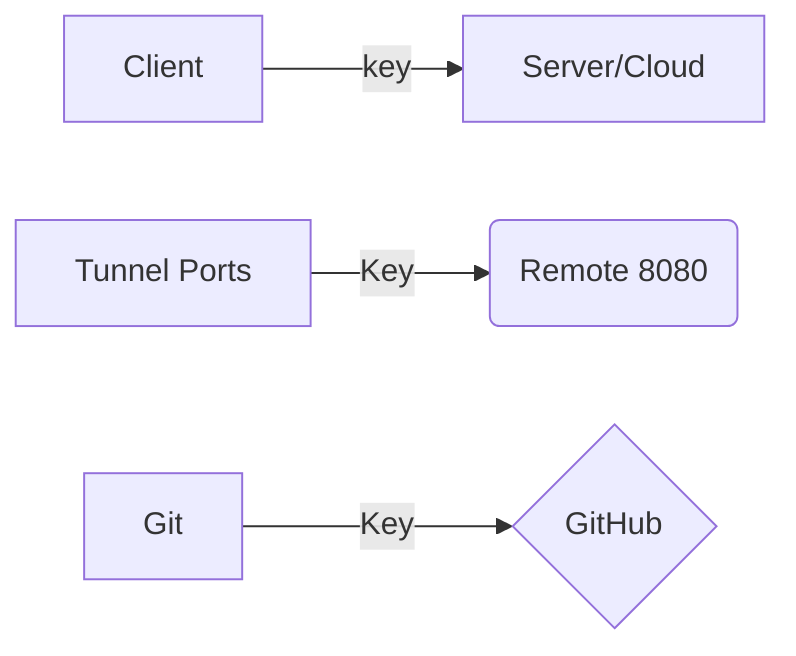

# linux_bash_data




## VM

Se pueden utilizar programas como [Parallels](https://www.parallels.com/mx/pd/general/?gclid=Cj0KCQjw_7KXBhCoARIsAPdPTfjUC4p6a_qPQ72dvOrr_f14ls4zR-ecWaQdTdTyCkokc9W3IiXQJ8gaAsODEALw_wcB), para elegir sistemas operativos y trabajar en ellos a través de la nube. 

Otra opción para trabajar bash en la nube son los servicios de [Amazon](https://signin.aws.amazon.com/signin?redirect_uri=https%3A%2F%2Fconsole.aws.amazon.com%2Fconsole%2Fhome%3FhashArgs%3D%2523%26isauthcode%3Dtrue%26nc2%3Dh_ct%26src%3Dheader-signin%26state%3DhashArgsFromTB_us-west-1_3e1f6a32a4275b6f&client_id=arn%3Aaws%3Asignin%3A%3A%3Aconsole%2Fcanvas&forceMobileApp=0&code_challenge=Z5G7MeEi2yoHGpSMItI7feahOjznNCoHnC0fUuN7ZZk&code_challenge_method=SHA-256), a partir de aquí podemos crear entornos con distintos sistemas operativos. 

Otra alternativa es tener una cuenta premium para acceder a **GitHub Codespace**. 

## Docker

Al tener docker podemos tener acceso a distitos entornos contenidos de distintos sistemas operativos, y acceder a Kubernets.

> Kubernetes es un sistema de código libre para la automatización del despliegue, ajuste de escala y manejo de aplicaciones en contenedores que fue originalmente diseñado por Google y donado a la Cloud Native Computing Foundation. Soporta diferentes entornos para la ejecución de contenedores, incluido Docker.

# Comandos útiles

- `mdfind` para encontrar archivos a traves de una palabra clave.
- `chmod +x` para hacer ejecutables los archivos en caso de no tener permisos. 

## Hora y fechas:

- `cal` abre un calendario
- `date` fecha y hora actual

## Uso de disco o tamaño de archivos:

- `df -h` despliega los discos y su uso de memoria.
- `du -sg *` despliega el tamaño de los archivos del directorio.

> Para conocer la lista de todos los comandos disponibles, se localizan en el directorio `/bin/` y con `ls -l` los puedes desplegar. 

# Usando Shell

## Explorar

- `pwd` conocer el path 
- `ls -lah`ver la lista de archivos con permisos
- `cd ~` para regresar al home

## Ver archivos

- `less`
- `cat`
- `wc -l /etc/passwd` para ver el numero de lineas de un archivo

## Modificar archivos y directorios

- `touch newfile.txt` para generar nuevos archivos.
- `mkdir newdir` crear directorios
- `mkdir -p moredir/dir1/dir2` para crear todo el PATH
- `rm -rf moredir` para eliminar todo el directorio 
- `mv` comando para mover archivos; también funciona para renombrar un archivo

## Procesos

- `ps` para monitorear procesos
- `ps -ef | grep spotify` para buscar un proceso en especifico
- `jobs` para ver los procesos detenidos o pausados
- `Ctrl` + `c` para detener procesos
- `Ctrl` + `z` para pausar procesos
- `fg 1` para reanudar procesos que se dejaron en pausa, y encaso de que los procesos esten con `&` en el background, con `fg 1` se vuelven a la terminal para poder ser pausados o eliminados.


> Una forma útil de aprender bash es checar los dockers de configuración de los lenguajes de programación más famosos, como por ejemplo [python](https://hub.docker.com/_/python)

# Pipelines

El simbolo del pipe es `|`, el de output del pipelie es `>`. Para hacer un pipe pero condicionado a qué primero se ejecute el código anterior, se usa `&&`.

Ejemplo: `ls -l /bin && touch newfile.txt`

Ejemplos:

```
STR=$'1. This is a line\n2. This is a line\n3. This is a line.'
echo "$STR" > lines.txt

cat lines.txt | sort -r 

cat lines.txt | sort -r | less

cat lines.txt | grep 3 > match.txt

```

Para agregar texto a un archivo. Con el simbolo `>>` se agrega en vez de sobreescribir. 

```
echo "something" > append.txt
echo "overwrite" > append.txt

echo "another thing" >> append.txt
```

Para echar a la basura el output se usa el siguiente comando `2>`

```
ls -l /wrong/path 2> /dev/null
```

Para ver elementos finales o iniciales de un archivo

```
head -f /PATH/file.txt
head -n 4 /PATH/file.txt

tail -n 4 /PATH/file.txt
```

Para navegar por el historial con pipes

```
history | less
history | grep tail
```
 Con el comando `!`seguido de la linea del historial que quieras volver a ejecutar. **Ejemplo:** `!56` se vuelve a ejecutar el código de la linea 56 del historial.  
 
 Para correr el último código del historial se usa el comando `!!`.

# SSH


