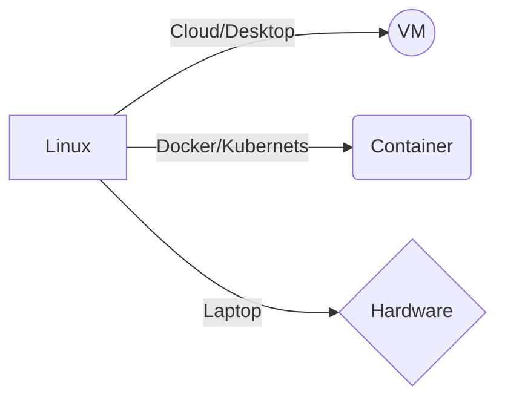
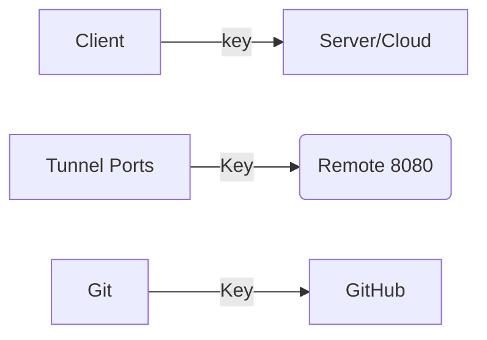

# linux_bash_data




## VM

Se pueden utilizar programas como [Parallels](https://www.parallels.com/mx/pd/general/?gclid=Cj0KCQjw_7KXBhCoARIsAPdPTfjUC4p6a_qPQ72dvOrr_f14ls4zR-ecWaQdTdTyCkokc9W3IiXQJ8gaAsODEALw_wcB), para elegir sistemas operativos y trabajar en ellos a través de la nube. 

Otra opción para trabajar bash en la nube son los servicios de [Amazon](https://signin.aws.amazon.com/signin?redirect_uri=https%3A%2F%2Fconsole.aws.amazon.com%2Fconsole%2Fhome%3FhashArgs%3D%2523%26isauthcode%3Dtrue%26nc2%3Dh_ct%26src%3Dheader-signin%26state%3DhashArgsFromTB_us-west-1_3e1f6a32a4275b6f&client_id=arn%3Aaws%3Asignin%3A%3A%3Aconsole%2Fcanvas&forceMobileApp=0&code_challenge=Z5G7MeEi2yoHGpSMItI7feahOjznNCoHnC0fUuN7ZZk&code_challenge_method=SHA-256), a partir de aquí podemos crear entornos con distintos sistemas operativos. 

Otra alternativa es tener una cuenta premium para acceder a **GitHub Codespace**. 

## Docker

Al tener docker podemos tener acceso a distitos entornos contenidos de distintos sistemas operativos, y acceder a Kubernets.

> Kubernetes es un sistema de código libre para la automatización del despliegue, ajuste de escala y manejo de aplicaciones en contenedores que fue originalmente diseñado por Google y donado a la Cloud Native Computing Foundation. Soporta diferentes entornos para la ejecución de contenedores, incluido Docker.

# Comandos útiles

- `mdfind` para encontrar archivos a traves de una palabra clave.
- `chmod +x` para hacer ejecutables los archivos en caso de no tener permisos. 

## Hora y fechas:

- `cal` abre un calendario
- `date` fecha y hora actual

## Uso de disco o tamaño de archivos:

- `df -h` despliega los discos y su uso de memoria.
- `du -sg *` despliega el tamaño de los archivos del directorio.

> Para conocer la lista de todos los comandos disponibles, se localizan en el directorio `/bin/` y con `ls -l` los puedes desplegar. 

# Usando Shell

## Explorar

- `pwd` conocer el path 
- `ls -lah`ver la lista de archivos con permisos
- `cd ~` para regresar al home

## Ver archivos

- `less`
- `cat`
- `wc -l /etc/passwd` para ver el numero de lineas de un archivo

## Modificar archivos y directorios

- `touch newfile.txt` para generar nuevos archivos.
- `mkdir newdir` crear directorios
- `mkdir -p moredir/dir1/dir2` para crear todo el PATH
- `rm -rf moredir` para eliminar todo el directorio 
- `mv` comando para mover archivos; también funciona para renombrar un archivo

## Procesos

- `ps` para monitorear procesos
- `ps -ef | grep spotify` para buscar un proceso en especifico
- `jobs` para ver los procesos detenidos o pausados
- `Ctrl` + `c` para detener procesos
- `Ctrl` + `z` para pausar procesos
- `fg 1` para reanudar procesos que se dejaron en pausa, y encaso de que los procesos esten con `&` en el background, con `fg 1` se vuelven a la terminal para poder ser pausados o eliminados.


> Una forma útil de aprender bash es checar los dockers de configuración de los lenguajes de programación más famosos, como por ejemplo [python](https://hub.docker.com/_/python)

# Pipelines

El simbolo del pipe es `|`, el de output del pipelie es `>`. Para hacer un pipe pero condicionado a qué primero se ejecute el código anterior, se usa `&&`.

Ejemplo: `ls -l /bin && touch newfile.txt`

Ejemplos:

```
STR=$'1. This is a line\n2. This is a line\n3. This is a line.'
echo "$STR" > lines.txt

cat lines.txt | sort -r 

cat lines.txt | sort -r | less

cat lines.txt | grep 3 > match.txt

```

Para agregar texto a un archivo. Con el simbolo `>>` se agrega en vez de sobreescribir. 

```
echo "something" > append.txt
echo "overwrite" > append.txt

echo "another thing" >> append.txt
```

Para echar a la basura el output se usa el siguiente comando `2>`

```
ls -l /wrong/path 2> /dev/null
```

Para ver elementos finales o iniciales de un archivo

```
head -f /PATH/file.txt
head -n 4 /PATH/file.txt

tail -n 4 /PATH/file.txt
```

Para navegar por el historial con pipes

```
history | less
history | grep tail
```
 Con el comando `!`seguido de la linea del historial que quieras volver a ejecutar. **Ejemplo:** `!56` se vuelve a ejecutar el código de la linea 56 del historial.  
 
 Para correr el último código del historial se usa el comando `!!`.

# SSH



Para crear una llave pública **ssh** se usa el siguiente código:

```
ssh-keygen -t rsa
```

Despues usar `cat /home/ec2-user/.ssh/id_rsa.pub` y copiar a GitHub.


# Configuración .bashrc y .zshrc

Para configurar el `.bashrc` se accede con el vim o nvim. Ahi se pueden añadir Aliases, y establecer variables asi como entornos. `vim ~/.bashrc` ó `nvim ~/.bashrc`.

Para instalar en la terminal ssh la [zsh](https://ohmyz.sh), se usa **on-my-zsh**, Mac ya tiene por default esta actualización. En linux se usa el siguiente comando para instalarla: `sh -c "$(curl -fsSL https://raw.github.com/ohmyzsh/ohmyzsh/master/tools/install.sh)"`.

Para modificar la configuración de `zsh` se usa `vim ~/.zshrc`, ahi se pueden agregar [temas](https://github.com/ohmyzsh/ohmyzsh/wiki/Themes) y [plugins](https://github.com/ohmyzsh/ohmyzsh/tree/master/plugins).

Existen comando exclusivos para MacOS, se pueden ver con `diskutil`. 


# Variables de Shell

Para crear una variable en Shell se utiliza `export`.

Ejemplo:

```
export FOOD="apple"
echo $FOOD
echo "I love" $FOOD
```

Se pueden declarar variables simplemente de entorno, pero siempre será mejor declararlas con `export`. Estas variables también se pueden guardar en el archivo de configuración `.basrc` ó `.zshrc`.

Para generar **entornos** personalizados por proyecto se puede hacer lo siguiente:

1. Crear un archivo `.sh` en la carpeta de un proyecto especifico. `touch projectENV.sh`
2. Modificar ese archivo. `nvim projectENV.sh`
3. Agregar al archivo las variables y las modificaciones que se deseen hacer en ese entorno. `export SECRET="ABCD"`.
4. Modificar el archivo de configuración `.zshrc` o `.bashrc`. `nvim ~/.zshrc`.
5. Agregar al archivo el alias al PATH donde se localiza `projectENV.sh` como por ejemplo: `alias myproject="cd /Users/erickCuevas/Documents/cursera/linux_bash_data/project && source /Users/erickCuevas/Documents/cursera/linux_bash_data/project/projENV.sh" 
6. Ahora si, al darle source a nuestro `.zshrc` modificado se puede acceder al entorno que creamos para el proyecto especifico al solo teclar `myproject`. 

# Standard Streams (flujos estandar)

EStos flujos en UNIX se utilizan para filtrar y procesar los datos, y ver los errores en el camino. 

## Usando Standard Out

El comando `>>` agrega al output que ya existe. En cambio el comando `>` sobreescribe. 

Para contar elementos unicos se utiliza el siguiente ejemplo:

```
echo -e "Apple\nCarrot\nBanana" | sort | unique -c
``` 

Para encontrar patrones de caracteres se utiliza:

```
echo -e "Apple\nCarrot\nBanana" | sort | unique -c | grep Apple

ps -ef | grep python
```

Para revertir el orden de un caracter se utiliza lo siguiente:

```
echo -1993 | rev
```

## Usando Standard In

Para esblecer inputs se puede utilizar `read -p 'File: ' FILENAME` o `less < fruit.txt`. 

# Usando Standard Error

**Crear error**

```
ls -l /var/FAKEDIR
```

**Escribiendo el error a un archivo**

```
ls -l /var/FAKEDIR 2> error.txt

# O para agregar los errores

ls -l /var/FAKEDIR 2>> error.txt

```

**Eliminar el error**

```
ls -l /var/FAKEDIR 2> /dev/null
```

# If Else
Creando el archivo con `nvim if-else.sh`

```
#!/bin/sh
echo "What a food do you choose?"
read FOOD

if [ "$FOOD" = "Apple" ]; then
    echo "You are a healthy person"
elif [ "$FOOD" = "Pizza" ]; then
    echo "You are a fat person"
else
    echo "You are a vegetarian"
fi

```

Para darle permisos de ejecución `chmod +x if-else.sh` y ejecutandolo `./if-else.sh`. 

# Shell Loops

Los ejemplos se hicieron con *nvim*. 

## Evaluar condiciones

Para evaluar condiciones se utiliza **AND** que es bash es `&&` y **OR** que es `||`. Estos sirven para hacer pipes uno por ejemplo con `&&` el siguiente proceso solo sucede sio antes se logró el anterior. En contrario el `||` si no sale un proceso pasa al que sigue. 

# Manipular data con bash shell

## Truncate 

- `head`
- `tail`
- `shuf` (este comando muestra aleatoriamente)

## Filter 

- `grep`
- `cut`

Ejercicios:

```
echo "¿Cuantas lineas quieres?"
read LINES
declare -a array=("apple" "pear" "cherry)

COUNT=1
while [ $COUNT -le $LINES ]
do
  rand=$[ $RANDOM % 3 ]
  echo "$COUNT ${array[$rand]}" >> filter-file.txt
  ((COUNT++)
done
```

**Para encontrar un patrón**: `grep apple filter-file.txt`

**Para contar ocurrencias**: `grep -c apple filter-file.txt`

**Para encontrar dos patrones**: `grep -e apple -e pear filter-file.txt`

**Contar ocurrencias de ambos patrones**: `grep -c -e apple -e pear filter-file.txt`

**Mostrar todas las líneas que NO contengan el patrón**: `gerp -v apple filter-file.txt`


## Search

- `find`
- `locate`

**Encontrar todos los scripts de bash**: `find . -name "*.sh"`

**Encontrar todos los archivos CSV**: `find . -name "*.csv"`

**Encontrar todos los ejecutables no visibles**: `find . -perm /+x ! -name '.*' -type f`

**Encontrar todos los ejecutables no visibles e ignorar los directorios .git**: `find . -perm /+x -not -path '*/\.*' -type f`

# Bash Script

Componentes Principales:

- shebang line
- debg modes
- statements and variables

```
#!/usr/bin/env bash
#
# This is where comments go
# It can be useful to explain the purpose of your code 
## Note you can also start your script with #!/usr/bin/bash -xv for verbose debugging
## https://tldp.org/LDP/Bash-Beginners-Guide/html/sect_02_03.html

# Set strict mode. Causes shell to exit when a command fails
set -e

# Enables printing of shell input lines as they are read
set -v

# Enables print of command traces before executing command
set -x

# Set a variable
variable="one"

echo "This is a script with a variable: $variable"

```

# Bash function

```
#!/usr/bin/env bash
#
## Basic structure
#function_name (){
#   command
#}

# Parameters 
mimic () {
  echo "First Parameter: $1"
  echo "Second Parameter: $2"
}

# Call the function with two parameters
mimic 1 2

mimic 99 100

```

```
# Add function
add() {
  num1=$1
  num2=$2
  result=$((num1 + num2))
  echo $result
}

# Capture output of a function 
# will echo 14
output=$(add 5 9)
echo $output

add $output $output
```

# Building a Command-Line Tool in Bash

A. Build Function
B. Parse input
C. Pass input to function

```
#!/usr/bin/env bash
#output looks like this:
#
# Run script:
#      ./cli.sh --count 5 --phrase "hello world"
#hello world
#hello world
#hello world
#hello world
#hello world

## A. Does the work
#Generate phrase "N" times
phrase_generator() {
   for ((i=0; i<$1;i++)); do
     echo "$2"
   done
}

## B. Parses input from the CLI
#Parse Options
while [[ $# -gt 1 ]]
do
key="$1"

case $key in
   -c | --count)
   COUNT="$2"
   shift
   ;;
   -p | --phrase)
   PHRASE="$2"
   shift
   ;;
esac
shift
done

## C. Pass parsed input to function and run everything
#Run program
phrase_generator "${COUNT}" "${PHRASE}"

```

# Bash-Adjacent Tools

## Makefiles

Para hacer un `makefile` se puede usar **nvim** del siguiente modo: `nvim makefile`. Dentro del archivo se puede automatizar procesos, declarar receta, y se parace mucho a bash. Para acceder a las **"recetas"** basta con usar el comando `make`.  

Links para aprender mas:
- [https://github.com/theicfire/makefiletutorial](https://github.com/theicfire/makefiletutorial)
- [https://makefiletutorial.com](https://makefiletutorial.com)
- [https://www.cs.oberlin.edu/~kuperman/help/vim/makefiles.html](https://www.cs.oberlin.edu/~kuperman/help/vim/makefiles.html)


## Dockerfile

Este tipo de archivo nos permite automatizar procesos, generar contededoras y dar formato. Se generan también con **nvim**. Y una vez el archivo esta lito se usa el comando `docker build .`
Para ver las imagenes de docker generadas se usa `docker image ls`. Para ejecutar el contenedor usamos el ID de la imagen `docker run -it 41137ec71c1d bash`.

Para aprender más:

- [https://linuxhint.com/create-dockerfile/](https://linuxhint.com/create-dockerfile/)
- [https://docs.docker.com/compose/gettingstarted/](https://docs.docker.com/compose/gettingstarted/)
- [https://docs.docker.com/develop/develop-images/baseimages/](https://docs.docker.com/develop/develop-images/baseimages/)

# Data Structures in Bash

Existen dos tipos: arrays y hashes

```
#!/usr/bin/env bash

#This is a bash list/array
declare -a array=("apple" "pear" "cherry")

## now loop through the above array
for i in "${array[@]}"
do
  echo "This ${i} is delicious!"
done
```

```
#!/usr/bin/env bash
# Requires Bash >=4.0

declare -A mealhash=([dinner]="steak" [lunch]="salad" [breakfast]="fruit" )

# now loop through the above
for key in "${!mealhash[@]}"; do
  echo "For $key I like to eat: ${mealhash[$key]}"
done
```

# Searching a Filesystem in Linux

- Visual: dir
- Live: `find .txt`
- Metadata: `locate .txt` ; `mdfind`

`sudo updatedb`

`locate -c .zshrc`

`locate .zshrc`

`find . -name .zshrc`

`sudo find / -name .zshrc`


`touch /tmp/foo{0..10}.txt` para generar 11 archivos. 

`ls -l /tmp`

`find /tmp -name foo* -type f -print`

Para usar una función se usa `xargs`:

`find /tmp -name foo* -type f -print | xargs /bin/rm -f`

**`mdfind`**

# Modify the filesystem in Linux

**C** Create: touch, mkdir

**R** Read: cat, less, grep

**U** Update: mv/tar/zip/chmod

**D** Delete: rm, rmdir

## Moving files and Directories in Linux 

`mkdir foo` 

`mkdir -p bar/bam/biz` # esto para generar todos los directorios 

Para generar un archivo dentro del directorio generado `touch bar/one.txt`

`ls -lR bar`

Para mover archivos y directorio se usa `mv`

Para copiar `cp -r bar/bam .`

`rsync` hace que se sincronicen varios directorios

`rsync -av foo/ newspot/foo/` 

## Setting permissions on Files and Directories in Linux

`ls -l` 

`chmod +x script.sh` 

`sudo su -`

`whoaim`


## Archiving Data in Linux

### Zip

```
#archive
zip -r archives/foo.zip foo
cd archives

#unarchive
unzip foo.zip
```

### Tar
```
#archive
tar -zcvf archives/foo.tgz foo

#unarchive
tar -zxvf foo.tgz
```

# Processing Text in Linux

`grep -c name file.txt`

`diff fruit1.txt fruit2.txt`

`uniq -c fruits1.txt`

`sort fruits.txt`

`cat nissa_stocks.txt | rev | cut -d, -r1 | rev`

`cat nissa_stocks.txt | rev | cut -d, -r1 | rev > new_nissan.txt`

`shuf -n 10 nissan_stocks.txt` # selecciona de manera randon el numero de filas que decidas

## Editing with Truncation, awk and sed in Linux

### You can also transliterate
`echo "lower" | tr a-z A-Z`

`echo "hello" | tr a-z A-Z`

### You can combine truncate and transliterate together

shuf -n 1 amazon_review_5k.txt | tr a-z A-Z

# Replace occurrences of MIXED with NEGATIVE

`echo "MIXED" | sed 's/MIXED/NEGATIVE'`

### sed

`shuf -n 100 nissa_stocks.txt | sed 's/2004/2023/'`

`shuf -n 100 nissa_stocks.txt | sed 's/2004/2023/' | grep -c 2023`


### AWK

[awk](https://web.archive.org/web/20061017103958/http://cm.bell-labs.com/cm/cs/awkbook/index.html)


## Using Regular Expressions (regex) in Linux

`echo 415-444-5599 | grep '\(([0-9]\{3\})\|[0-9]\{3\}\)[ -]\?[0-9]\{3\}[ -]\?[0-9]\{4\}'` 

`cat phone-numbers.txt | grep '\(([0-9]\{3\})\|[0-9]\{3\}\)[ -]\?[0-9]\{3\}[ -]\?[0-9]\{4\}'` 

`ls | grep -Eh 'phone|fruit'`

 `grep -EH '2005|2006' nissa_stocks.txt| wc -l`


